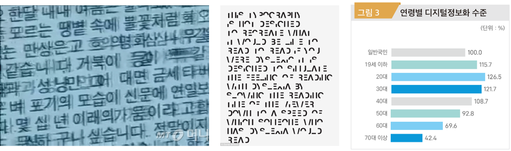

# Eyelax 

## 프로젝트 소개

>시각장애인 분들이나 노인, 난독증 환자들을 위해 다양한 기능을 제공해	웹페이지의 정보 이해를 돕는 프로그램이다. 

>글의 확대, 소리내어 읽어주기, 가독성 좋은 글씨로 바꾸기, 사전기능 등이 구현되어 있다. 

## 배경 및 문제현황

>PC사용이 증가하고 정보의 공유와 소통 등 대부분이 인터넷 통해 이루어지고 있다. 
상대적으로 많은 정보를 한 화면에 보여주는 pc의 특성상 시야가 좁거나 글을 읽는데에 어려움이 있는 사람들은 정보에 접근하기가 어렵다. 

>저시력 시각장애인이나 노인 분들을 화면에 표시되는 글씨가 작거나 알아보기 힘든 색으로 이루어져 있으며 특히 낯선 신세대 용어의 사용으로 노인분들을 웹페이지 글의 이해가 어렵다. 

## 프로젝트 대상

>인터넷 웹페이지 사용에 어려움을 겪고 있는 시각장애인, 노인, 난독증 환자 분들을 대상으로 한다. 

## 기대하는 효과

>노인분들이 PC사용에 익숙해지며 세대간 원활한 소통이 이루어지는 것을 기대한다. 

>회사 업무가 보통 이메일로 이루어지는데 저시력 장애인 분들이나 난독증 환자들은 업무 지시를 이해하는데 오랜 시간이 걸려 난처한 상황을 해결 할 수 있을 것으로 본다. 

## Prototype
